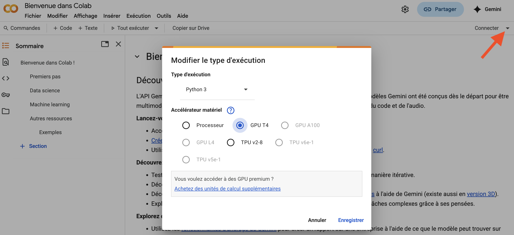

# DLAA_2025
Source files for the practical session on time series of  the summer school "Deep Learning and applications 2025"( https://indico.math.cnrs.fr/event/14421/ )

## Installation
You need a Google account.
(if you don't want to have one, you can also, with small adaptations, run the Jupyter notebooks on a computer with a recent 16GB GPU)
Create first at the root of your Google drive a folder named `DLAA_2025`
In this folder, copy the following files from the repository:

- `dataset.jsonl` : the dataset that has been generated from a large LLM (pixtral-large) and curated.
- `time_series.ipynb` : a notebook for fine tuning the small Qwen LLM.
- `check_training.ipynb`: a notebook for checking the training of the small Qwen LLM.

Then, in Google drive, open the file `time_series.ipynb` with Google Colab.
You have to activate the T4 GPU execution from the colab menus:

You can execute the notebook step by step. You will have to grant access to your Google drive at one moment. Just allow read and write access to files (not to other marketing-related access...)

The notebook creates a folder `qwen2.5-0.5b-instruct-lora-output` with all the results.

Once the training is finished (or at least one checkpoint has been saved), you can open the notebook `check_training.ipynb`.

This notebook creates a subfolder `plotdiag` where you can check the results of the training on the testing part of the dataset.